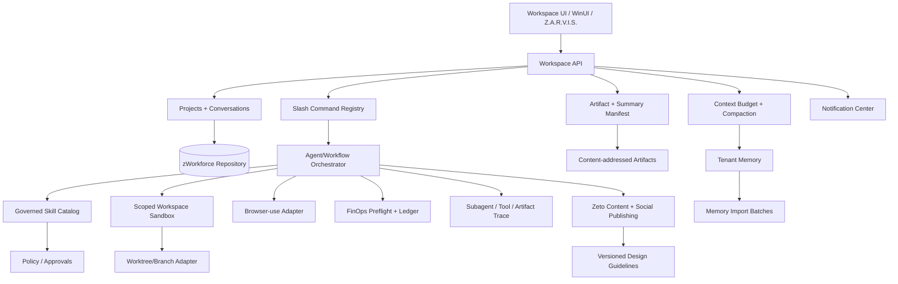

# Skywork Changelog Reverse Engineering → zWorkforce Upgrade Map

**Research date:** 2026-08-17  
**Target:** `cvsz/zworkforce`  
**Primary official sources:**
- `https://skywork.ai/help/changelog`
- `https://skywork.ai/help`
- `https://skywork.ai/desktop/en/changelog.html`

## 1. Scope and interpretation

This document uses Skywork only as a product-capability reference. It does not copy proprietary implementation details, hidden prompts, UI assets, or code. The goal is to identify publicly documented product patterns that can improve zWorkforce while preserving zWorkforce's stronger existing boundaries: tenant isolation, server-side secrets, durable state, explicit mutation approval, bounded execution, audit/provenance, and release evidence.

The Help changelog page is JavaScript-driven and does not expose its full historical list to the current fetcher. The Help landing page currently exposes recent web-product changelog items including Social Publishing Flow, Design Guidelines in Knowledge Base, and SkyClaw memory import. The official Skywork Desktop changelog provides the complete release history currently visible from 1.1.0 through 2.5.0 and is therefore the main chronological evidence source below.

## 2. Public Desktop changelog timeline and reusable product patterns

| Release | Date shown | Publicly documented capability pattern | zWorkforce interpretation |
| --- | --- | --- | --- |
| 1.1.0 | date not shown | installer hardening, signed packages, specific startup diagnostics, version visibility, direct health checks | signed operator clients, deterministic diagnostics, health probes that do not depend on unrelated proxies |
| 1.1.1 | date not shown | feedback with runtime/frontend logs, region-aware feature gating, model update, installer tolerance | redacted support bundles, policy/region feature gates, robust bootstrap diagnostics |
| 1.2.1 | date not shown | resilient input/workspace history, login validation, file-history deletion, model fallback/hot update, standardized cost logs | durable conversation/file history, auth-before-create, provider fallback evidence, normalized FinOps events |
| 1.3.0 | date not shown | persistent/searchable conversations, custom skill install/enable/disable/delete, theme switching | project/conversation persistence and search, governed skill lifecycle, operator theme tokens |
| 1.4.0 | 2026-04-23 | IM integrations, conversation history, workspace preview, usage visibility, add API key when skill blocked | connector-backed agent channels, scoped history, workspace/artifact preview, credential-reference remediation without exposing secrets |
| 1.5.0 | 2026-05-09 | office/document/design/search skills, local app file preview, desktop notifications, credit views | artifact-native worker skills, native file open/reveal, notifications, FinOps balance/usage surfaces |
| 1.5.1 | 2026-05-18 | curated built-in skills, HTML preview, slash skill picker, mixed file/instruction task creation | verified system skill packs, safe HTML/artifact preview, command palette, multimodal task composer |
| 1.6.0 | 2026-06-02 | local folder read/write, memory, browser automation, mid-generation interruption, hot updates | sandboxed workspace grants, tenant memory, Zider browser-use executor, interrupt/cancel semantics, signed update channels |
| 2.0.0 | 2026-06-30 | local sandbox model, project coding, worktree/branch isolation, scheduled automation, project organization, expanded MCP | workspace sandbox service, isolated git workspaces, automation UI, project-scoped context, MCP connector control plane |
| 2.0.2 | 2026-07-01 | output artifact list in summaries, clearer execution-state display | durable task result manifest and operator-readable execution timeline |
| 2.0.3 | 2026-07-03 | sub-agent visibility, artifact preview cards, rebuilt summary panel | subagent trace projection, artifact cards, structured task summary sidecar |
| 2.1.0 | 2026-07-09 | multi-tab review/file/side-chat panel, continue from agent message, subagent chat visibility, system notifications | review sidecar, message forks, delegated-agent trace visibility, event notifications |
| 2.1.1 | 2026-07-10 | model panel additions and stability fixes | capability-driven model catalog rather than hard-coded UI assumptions |
| 2.2.0 | 2026-07-16 | conversation IDs, auto naming, historical-question navigation, rich composer, context status/compaction, slash commands, image skill | durable conversation identity, context-budget telemetry, compaction artifacts, command registry, multimodal skill invocation |
| 2.3.0 | 2026-07-23 | task quick start, next-step suggestions, credit preflight warning, summary side panel, richer attachments | task templates, evidence-based next-action recommender, budget preflight, unified summary/artifact panel |
| 2.4.0 | 2026-07-30 | personalized themes, immediate skill use after install, repeated workflow → reusable skill, system skill auto-update, better discovery/interruption | theme profiles, active skill versioning, workflow-to-skill candidate compiler, governed auto-update, skill matching/telemetry |
| 2.5.0 | 2026-08-05 | detailed credit ledger, in-app subscription/purchase, API signing improvements, Markdown source/preview toggle | chargeback event explorer, billing-provider boundary, signed service requests, dual Markdown source/rendered artifact view |

### 2.1 Current Skywork Web / Help changelog items visible to the crawler

The Help landing page currently exposes these recent changelog cards:

| Date | Public item | zWorkforce owner | Upgrade interpretation |
| --- | --- | --- | --- |
| 2026-07-17 | Social Publishing Flow Now Available in Poster | Zeto | compose/preview/approve/schedule/publish UX on top of the existing durable provider/outbox pipeline; do not add a second publisher |
| 2026-07-17 | Design Guidelines Now Available in Knowledge Base | Zeto + knowledge/artifacts + zsp-aitool | versioned tenant design-guideline artifacts/knowledge, project/brand policy binding, generation constraints and QA evidence |
| 2026-07-03 | SkyClaw Memory Management Upgrade — Import Memories from Other AIs | memory/RAG + workspace | operator-supplied import adapters with preview, source provenance, dedupe, consent, policy filtering and batch rollback/delete |

These three items broaden the desktop-derived roadmap in useful ways. They should still reuse zWorkforce's existing durable primitives:

- social publishing continues through approval, provider adapter, idempotency, outbox, retry/dead-letter and audit controls;
- design guidelines are policy-bearing/versioned records, not just prompt text injected from the browser;
- imported memory is untrusted user data. Imported instructions must never become system policy or expand tool authority.

## 3. Current zWorkforce overlap

zWorkforce already has substantial equivalents and should reuse them instead of building parallel stacks:

- durable tasks, workflows, scheduler, event triggers, leases and outbox;
- tenant-scoped memory and artifact storage;
- policy-as-code, tool grants and four-eyes approvals;
- Luna/Terra/Sol model tiers and provider failover;
- ProMeta agent/skill catalogs and a Z.A.R.V.I.S. runtime skill catalog;
- MCP management surface;
- Z.A.R.V.I.S. dashboard PTT and shared realtime voice client;
- Zider browser extension/BFF boundary;
- native Windows operator client;
- FinOps cost/chargeback primitives;
- release, SBOM, provenance, CodeQL and dependency-review gates.

The upgrade therefore focuses on missing user-facing orchestration and lifecycle layers rather than replacing core execution primitives.

## 4. Target capability architecture

## 5. Security rules for adoption

1. Local-folder access is a scoped workspace grant, never arbitrary host filesystem access.
2. Browser automation is read-only by default; clicks, form submits, uploads, purchases, account changes and publishing remain mutation-gated.
3. Skill installation never grants capabilities not already authorized by policy.
4. Automatic system-skill updates cannot silently expand tool allowlists, escalate read→write mutability, or weaken approval rules.
5. Old skill versions remain available for rollback until retention policy removes them.
6. Context compaction creates an attributable summary artifact; it does not silently rewrite durable memory.
7. Conversation/project identity is tenant-scoped and cannot be reassigned across tenants.
8. Subagent visibility exposes sanitized execution metadata, not hidden secrets or raw credentials.
9. Credit/budget preflight is advisory plus policy enforcement; billing state must come from durable ledger/provider evidence.
10. API signing protects service-to-service integrity but never replaces user/tenant authorization.
11. Imported memory remains untrusted tenant data; it never becomes authorization, system policy, or a tool grant.
12. Design guideline activation is versioned/audited and must not let browser clients inject hidden policy into production generation.
13. Social publishing remains an external mutation and follows explicit approval/idempotency/outbox evidence rules.

## 6. End-to-end delivery streams

### SW1 — Projects, conversations and context continuity

Deliver project-scoped durable conversations, IDs, search, pin/archive, auto naming, question anchors, context-budget telemetry, explicit compaction and deletion/forget flows.

Actual zWorkforce data surfaces:
- `zworkforce/db.py` — canonical database mixin composition;
- `zworkforce/db_base.py` — schema initialization/version boundary;
- `zworkforce/db_schema*.py` — additive schemas;
- `zworkforce/db_workspace.py` — workspace repository mixin;
- `zworkforce/workspace_api.py` — workspace HTTP composition over the core authenticated API;
- `zworkforce/static/` and `ZWorkforceClient/` — later operator UX;
- tenant memory and artifact services — context/artifact references, not a replacement conversation store.

**Implementation status:** SW1 durable project/conversation/message schema, tenant ownership, API and SQLite/PostgreSQL tests are being delivered in stacked PR `feat/workspace-project-conversations`.

### SW2 — Workspace sandbox and isolated coding workspaces

Add operator-granted local workspace roots, path canonicalization, deny traversal/symlink escape, bounded subprocess execution, git branch/worktree isolation, diff review, cleanup leases and auditable mutation approvals.

### SW3 — Review sidecar, artifact manifest and subagent trace

Expose task summary, artifacts generated/changed, review state, file preview, delegated-agent hierarchy, tool timeline, failures/retries and message-to-follow-up forks from durable execution events.

### SW4 — Context-aware composer and command registry

Add rich/mixed attachment composition and slash commands such as `/plan`, `/review`, `/compact`, `/goal`, `/status`, `/artifacts`, `/cost`, `/skill`, `/workflow`, with server-resolved command authorization.

### SW5 — Skill lifecycle and reusable workflows

- install and immediately resolve enabled skill versions;
- enable/disable and explicit rollback;
- safe system-skill auto-update;
- marketplace/remote signed package integration through the existing skill registry;
- repeated workflow detection that emits a **draft** reusable-skill/workflow candidate requiring review, tests and approval before activation;
- skill discovery ranking from task intent, capability constraints and observed outcomes.

**Implemented foundation:** governed active-version resolution, enable/disable, safe auto-update, rollback, fail-closed disabled-version execution and regression tests in the Z.A.R.V.I.S. orchestrator.

### SW6 — Browser-use and connector orchestration

Extend Zider into a first-class browser-use adapter with explicit read/mutate tool classes, domain allowlists, per-action evidence, cancellation, timeouts and human approval for side effects. Reuse MCP/connectors for IM and private systems.

### SW7 — Notification and proactive work center

Project/task completion, approval-needed, question-needed, failure, budget-risk and scheduled-agent events feed a tenant-scoped notification inbox plus optional approved connector delivery.

### SW8 — Operator UX and artifact-native previews

Add task quick-start templates, next-step suggestions, multi-tab sidecar, theme profiles, Markdown source/rendered mode, HTML preview sandboxing, native open/reveal where supported, and resilient artifact history.

### SW9 — FinOps preflight, credit ledger and signed service calls

Expose per-task predicted spend, tenant budget headroom, provider/model usage, actual cost events and chargeback. Add request signing only to internal service boundaries where replay protection, key rotation and clock-skew handling are defined.

### SW10 — Zeto social publishing and design guideline policy

- improve content composition/preview/approval around the existing Zeto publisher and outbox;
- bind projects/brands to an explicit active design-guideline version;
- expose guideline-derived generation constraints through server-side policy/context assembly;
- score generated assets against the active guideline in QA;
- persist guideline owner/source/hash/version/effective state and rollback history.

### SW11 — Portable memory import

- accept operator-supplied export files through an explicit import API/workflow;
- parse into a preview/staging batch before durable memory writes;
- record source provider label, source artifact hash, import batch ID, actor and timestamp;
- deduplicate and report conflicts;
- reject/redact secrets or disallowed sensitive fields by tenant policy;
- never execute imported instructions as system policy;
- commit only after explicit operator action and support batch rollback/delete where retention policy permits.

### SW12 — Release and evidence

Add contract/unit/integration/browser/package/Windows/security tests, accessibility review, sandbox escape tests, cross-tenant negatives, skill-update authority tests, memory-import provenance tests, Zeto publish idempotency tests, design-guideline version tests, load/failure drills, docs, migrations and rollback evidence.

## 7. Recommended PR sequence

1. **Skill lifecycle foundation** — active version, disable/enable, safe auto-update, rollback, tests. *(implemented foundation; CI green on the exact branch head at review time)*
2. **Durable workspace/project/conversation schema and APIs**. *(stacked implementation in progress)*
3. **Context budget + compaction artifact + slash command registry**.
4. **Task summary/artifact manifest + subagent execution projection**.
5. **Scoped local workspace sandbox + git worktree adapter**.
6. **Zider browser-use tool contract and approval-gated mutation executor**.
7. **Notification center + approved connector delivery**.
8. **Reusable workflow candidate compiler + skill discovery ranking**.
9. **Zeto social publishing UX + design guideline policy + portable memory import**.
10. **FinOps preflight + detailed ledger + signed internal service requests**.
11. **Workspace UX/WinUI parity, hardening, E2E and release evidence**.

## 8. Definition of complete

The Skywork-inspired upgrade is complete only when the implemented zWorkforce capabilities are durable, tenant-scoped, authorization-safe, observable and tested end-to-end. UI similarity or a documented roadmap is not sufficient. Every mutating workflow must preserve explicit zWorkforce approval/policy semantics, and any external connector, provider or production environment remains evidence-gated.