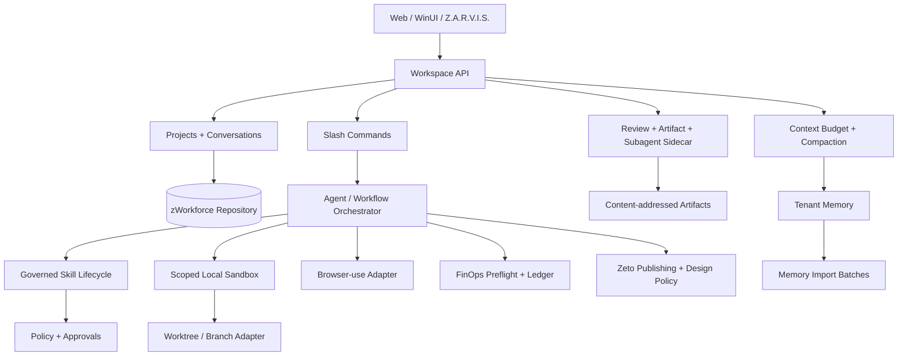

# Skywork Changelog Reverse Engineering → zWorkforce Upgrade Map

**Research date:** 2026-08-17  
**Target:** `cvsz/zworkforce`  
**Official sources verified:**
- `https://skywork.ai/help/changelog`
- `https://skywork.ai/help`
- `https://skywork.ai/desktop/en/changelog.html`

## 1. Evidence boundary

This document uses Skywork only as a public product-capability reference. It does not copy proprietary source code, hidden prompts, private APIs, or visual assets.

The direct Help changelog is JavaScript-driven and the current crawler does not expose its historical entries. The Help landing page does expose recent web-product changelog cards. The official English Skywork Desktop changelog exposes the historical Desktop sequence from **1.1.0 through 2.4.0** and currently labels **2.4.0 (2026-07-30) as Latest**. A separate official Skywork source confirming a Desktop 2.5.0 release was not found during the 2026-08-17 verification pass; therefore no 2.5.0 capability is treated as source evidence here.

## 2. Verified Skywork Desktop timeline → zWorkforce mapping

| Release | Date | Public capability pattern | zWorkforce-native upgrade |
| --- | --- | --- | --- |
| 1.1.0 | not shown | signed installer, startup diagnostics, version visibility, direct health | signed clients, deterministic diagnostics, independent health checks |
| 1.1.1 | not shown | feedback logs, region handling, installer tolerance | redacted support bundles, policy/region gating |
| 1.2.1 | not shown | resilient input/workspace history, auth-before-create, file-history deletion, model fallback, standardized cost logs | durable conversation/file history, authenticated creation, provider fallback evidence, normalized FinOps events |
| 1.3.0 | not shown | persistent/searchable conversations, custom skill install/enable/disable/delete, themes | durable projects/conversations, governed skill lifecycle, theme profiles |
| 1.4.0 | 2026-04-23 | IM integrations, conversation history, workspace preview, usage visibility | connector-backed agent channels, scoped history, artifact preview, usage surfaces |
| 1.5.0 | 2026-05-09 | office/design/search skills, desktop file preview, notifications, credit views | artifact-native skills, native preview/reveal, notification center, FinOps views |
| 1.5.1 | 2026-05-18 | curated skills, HTML preview, slash skill picker, file+instruction composer | verified system skills, sandboxed HTML preview, command palette, mixed task composer |
| 1.6.0 | 2026-06-02 | local folders, memory, browser automation, interruption, hot updates | scoped workspace grants, tenant memory, Zider browser-use, cancel/barge-in, signed updates |
| 2.0.0 | 2026-06-30 | local sandbox, coding projects, worktree/branch isolation, scheduled automation, project organization, expanded MCP | bounded local sandbox, isolated git worktrees, existing scheduler/automation UI, project context, MCP connectors |
| 2.0.2 | 2026-07-01 | artifact list in summaries, clearer execution status | durable result manifest and task timeline |
| 2.0.3 | 2026-07-03 | subagent visibility, artifact preview cards, summary panel | delegated-agent trace projection, artifact cards, summary sidecar |
| 2.1.0 | 2026-07-09 | multi-tab review/file/side-chat, follow-up from agent message, subagent chats, notifications | review sidecar, message forks, subagent trace, event notifications |
| 2.1.1 | 2026-07-10 | model-panel additions | capability-driven model catalog |
| 2.2.0 | 2026-07-16 | conversation IDs/auto naming/navigation, rich composer, context status/compaction, slash commands | durable conversation identity, context telemetry/snapshots, command registry |
| 2.3.0 | 2026-07-23 | quick task start, next-step suggestions, credit preflight, summary sidebar, richer attachments | task templates, next-action recommender, budget preflight, unified summary/artifacts |
| **2.4.0 Latest** | **2026-07-30** | themes, skills usable immediately after install, repeated workflow→reusable skill, system-skill auto-update, improved discovery/interruption | governed active skill version, safe auto-update/rollback, draft workflow-to-skill compiler, skill ranking |

## 3. Verified Skywork Web / Help items

The Help landing page currently exposes:

| Date | Public item | zWorkforce owner | Mapping |
| --- | --- | --- | --- |
| 2026-07-17 | Social Publishing Flow Now Available in Poster | Zeto | improve compose/preview/approve/schedule/publish on the existing durable publisher/outbox; do not create another publishing control plane |
| 2026-07-17 | Design Guidelines Now Available in Knowledge Base | Zeto + artifacts/knowledge + zsp-aitool | versioned tenant design-guideline artifacts, brand/project binding, generation constraints and QA evidence |
| 2026-07-03 | SkyClaw Memory Management Upgrade — Import Memories from Other AIs | memory/RAG + workspace | operator-supplied memory import with preview, provenance, dedupe, consent, policy filtering and batch rollback/delete |

Imported memory remains untrusted tenant data: imported instructions are never authorization, system policy, approvals, or tool grants.

## 4. Existing zWorkforce primitives to reuse

Do not build parallel stacks. Reuse:

- durable tasks, workflows, scheduler, event triggers, leases and outbox;
- policy-as-code, tool grants, four-eyes approvals and audit chain;
- tenant-scoped memory and content-addressed artifacts;
- Luna/Terra/Sol model routing and provider failover;
- ProMeta agents/skills and Z.A.R.V.I.S. runtime catalog;
- MCP management;
- Z.A.R.V.I.S. PTT/shared browser-safe voice client;
- Zider browser extension/BFF boundary;
- Windows operator client;
- FinOps/chargeback;
- CI, CodeQL, dependency review, SBOM/provenance and release evidence.

## 5. Target architecture

## 6. Security invariants

1. Workspace access is an explicit canonical-root grant, never arbitrary host filesystem access.
2. Browser automation is read-only by default; form submit, upload, purchase, account change and publishing are mutations.
3. Skill install/update never expands authority without explicit review/policy.
4. System-skill auto-update cannot add tools, escalate read→write, or weaken approval.
5. Old skill versions remain available for rollback until retention rules permit removal.
6. Context compaction creates a versioned summary artifact/snapshot; it never destroys source conversation history.
7. Projects, conversations, artifacts, memory and imports remain tenant scoped.
8. Subagent/tool visibility exposes sanitized evidence, not credentials or hidden secrets.
9. Cost preflight is backed by durable usage/policy data; never invent balances.
10. Imported memory and design guidelines cannot silently become system authorization.
11. Social publishing remains an approval/idempotency/outbox-governed external mutation.

## 7. End-to-end delivery streams

### SW0 — Governed skill lifecycle

**Implemented in PR #83 foundation.** Immediate active resolution, semantic versions, enable/disable, safe system auto-update, explicit rollback and fail-closed disabled-version execution. Automatic updates reject silent tool expansion, mutability escalation and approval weakening.

### SW1 — Durable projects and conversations

**Implemented on stacked PR #84.** Actual repository surfaces are:

- `zworkforce/db_schema_workspace.py`
- `zworkforce/db_workspace.py`
- `zworkforce/db_base.py`
- `zworkforce/db.py`
- `zworkforce/workspace_api.py`
- `zworkforce/workspace_cli.py`
- `tests/test_workspace.py`
- `tests/test_workspace_api.py`
- PostgreSQL coverage in `tests/test_v3_postgres.py`

The implementation uses composite tenant ownership, deterministic message ordinals, authenticated scopes, retention-aware deletion and audit without raw message bodies.

### SW2 — Context status, compaction and slash commands

Next slice. Persist context snapshots and summary artifacts, use measured provider usage where available, label estimates explicitly, bound provider calls/chunks/retries and require `workspace:compact` for durable/cost-incurring compaction.

### SW3 — Task summary / artifact / subagent sidecar

Project durable task/workflow events into review state, artifacts, sanitized tool calls, delegated-agent hierarchy, retries/failures/approvals, cost/model route and next actions.

### SW4 — Scoped local sandbox + git worktrees

Canonical path checks, traversal/symlink escape denial, command allowlists, resource/time/output bounds, sanitized environment, explicit write approval, isolated feature branches/worktrees and safe cleanup.

### SW5 — Zider browser-use contract

Separate read tools from mutating actions, enforce URL/domain policy, SSRF protections, cancellation/timeouts, external-side-effect idempotency and approval evidence.

### SW6 — Skill marketplace + reusable workflow candidates

Signed package trust, publisher/source metadata, discovery scoring and repeated-workflow detection that creates **draft** workflow/skill candidates requiring validation/tests/review before activation.

### SW7 — Notifications + proactive operator center

Durable task completion, approval-needed, question-needed, failure, budget-risk, scheduled-run and stalled-agent events. External delivery remains opt-in via approved connectors.

### SW8 — Zeto social publishing + design guidelines + memory portability

Improve Zeto publishing UX on existing durable primitives; add versioned design policies/QA; add memory import preview/provenance/dedupe/commit/rollback without trusting imported instructions.

### SW9 — FinOps preflight

Per-task cost range, tenant budget headroom, actual usage and chargeback drilldown by tenant/project/task/agent/model. Any future billing or request-signing capability requires its own verified requirement/source.

### SW10 — Web/WinUI UX + release hardening

Projects/conversations, pin/archive/search, context gauge, `/compact`, command palette, artifact/review sidecar, Markdown/source preview, safe HTML preview, themes, accessibility, E2E/security/load/failure/release evidence.

## 8. PR sequence

1. `feat/skywork-inspired-workspace-upgrade` — research/roadmap + governed skill lifecycle.
2. `feat/workspace-project-conversations` — durable project/conversation/message store and API.
3. `feat/workspace-context-commands` — context snapshots/compaction + slash commands.
4. `feat/workspace-task-sidecar` — artifact/review/subagent trace.
5. `feat/workspace-local-sandbox` — scoped local executor.
6. `feat/workspace-git-worktrees` — isolated coding workflow.
7. `feat/zider-browser-use-contract` — browser read/mutate boundary.
8. `feat/skill-marketplace-reusable-workflows` — signed install/discovery/candidate compiler.
9. `feat/zeto-design-memory-portability` — social publishing/design policy/memory imports.
10. `feat/workspace-notifications-finops` — notifications and budget/ledger UX.
11. `feat/workspace-ux-hardening` — Web/WinUI parity, accessibility, E2E and release evidence.

## 9. Definition of complete

The Skywork-inspired upgrade is complete only when the implemented capabilities are durable, tenant-scoped, bounded, authorization-safe, observable, rollback-capable and tested end-to-end. UI resemblance or documentation alone is not completion. External production claims remain subject to `docs/PRODUCTION-EVIDENCE.md`.