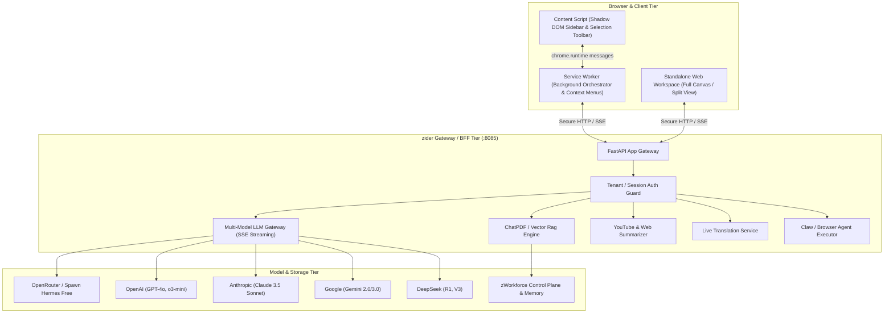

# zider Architecture & System Design

`zider` is a high-performance, full-stack AI browser sidebar & companion platform for zWorkforce, inspired by Sider.ai. It provides a persistent, unified interface for interacting with multi-model AI, reading, writing, translating, analyzing documents, and executing browser automation tasks.

## Architectural Components

### 1. Browser Extension (Manifest V3)
- **Shadow DOM Isolation**: The sidebar is rendered in an isolated Shadow DOM container inside host web pages, preventing CSS collision, DOM interference, or stylesheet leakage.
- **Selection Toolbar**: Floating instant toolbar appears on user text selection for rapid Explain, Summarize, Translate, Rewrite, and Grammar checking.
- **Background Service Worker**: Handles hotkey shortcuts (e.g., `Cmd+M` / `Ctrl+M`), context menu items, tab capture, and streaming network requests to the zider BFF.

### 2. Multi-Model Streaming Gateway
- Single chat mode with active model switcher.
- **Group AI Chat**: Parallel multi-model dispatch to compare responses (e.g., Claude 3.5 Sonnet vs. DeepSeek R1 vs. GPT-4o vs. Hermes 3).
- Direct fallback to 100% free OpenRouter / Spawn Hermes models when local or zero-cost operation is desired.

### 3. Document & Media Intelligence
- **ChatPDF**: PDF parsing, chunking, and semantic vector Q&A.
- **YouTube Summarizer**: Automatic transcript retrieval and time-stamped structured summary generation.
- **Webpage Summarizer & Reader Mode**: Clean reader extraction of article body for instant question answering.

### 4. Enterprise Security & Isolation
- Conforms to all zWorkforce strict tenant boundary rules: zero static secret exposure, bounded agent tool calls, and deny-by-default execution.
