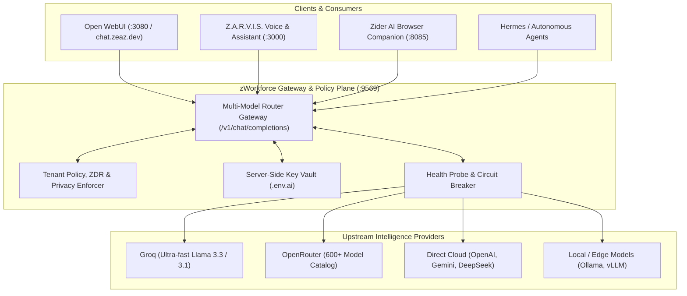

# zWorkforce Multi-Model Router & Gateway Execution Plan (exec-planning-router)

**Updated:** 2026-08-17  
**Status:** Active Execution Plan  
**Scope:** `zworkforce` Model Router, OpenRouter Integration, Open WebUI Gateway, and Provider Privacy/Failover Policies  
**Parent Framework:** [`exec-planning.master.md`](exec-planning.master.md) & [`../ROADMAPS.md`](../ROADMAPS.md)

---

## 1. Executive Summary & Objectives

The zWorkforce Multi-Model Router is the central gateway providing unified OpenAI-compatible routing (`http://api:9569/v1` and Open WebUI on `:3080`) across local and cloud intelligence providers (Anthropic, OpenAI, Google, DeepSeek, Groq, Meta, Mistral, Moonshot, and OpenRouter's 600+ model catalog).

### Key Objectives:
1. **Zero Secret Leakage**: Provider credentials and management tokens remain strictly server-side; client UIs and extensions never receive raw API keys.
2. **Dynamic Provider Fallback & Load Balancing**: Automatic failover from high-latency/unavailable providers to ultra-fast endpoints (e.g. Groq Llama 3.3) with sub-second switchover.
3. **Privacy & Data Governance**: Strict adherence to tenant boundaries, Zero Data Retention (ZDR) requirements, data training policies, and allowed provider allowlists.
4. **Interactive Enterprise Surface**: Seamless integration with Open WebUI (`zworkforce-open-webui`), Code Artifacts engine, and RAG semantic knowledge ingestion.

---

## 2. Router Architecture & Data Flow



---

## 3. Work Breakdown Structure (WBS) & Implementation Milestones

### Phase 1: Core Gateway & Open WebUI Foundation (Completed)
- [x] **Containerized Control Center**: Open WebUI deployed via `compose.open-webui.yml` on port `3080`.
- [x] **Database User & RBAC Setup**: Admin role and full permissions provisioned for authorized operational emails (`cvsitem@gmail.com`, `sea@zeaz.dev`, `sea@cvs.in.th`, `seaza@msn.com`).
- [x] **OpenAI Compatible Endpoint**: Routing layer configured to point to zWorkforce Multi-Model Router (`http://api:9569/v1`).
- [x] **Code Artifacts & Interactive Preview**: Interactive HTML, React, and SVG artifact rendering enabled.

### Phase 2: Upstream Provider & Key Resilience (Active)
- [x] **OpenRouter Dynamic Provisioning**: Management key provisioning integration to generate and rotate working API keys with zero manual downtime.
- [x] **Groq High-Speed Tier**: Direct integration with Groq API (`gsk_...`) for `llama-3.3-70b-versatile` and `llama-3.1-8b-instant` fallback.
- [ ] **Automated Key Health Heartbeat**: Background task polling upstream auth endpoints every 15 minutes to flag revoked or expired credentials before user impact.
- [ ] **Automatic Key Rotation Outbox**: Trigger alerts and rotation hooks when an upstream key incurs repeated 401/403 responses.

### Phase 3: Privacy, Guardrails & Policy Routing (In Progress)
- [x] **Account-Level Privacy Sync**: Document and maintain compliance for OpenRouter Data Training policies (`Allow free endpoints that train on request data` & `Allow free endpoints that publish prompts`).
- [x] **Allowed Provider Routing**: Complete provider mapping allowlist ensuring zero unintended provider lockouts.
- [ ] **Zero Data Retention (ZDR) Enforcement**: Header injection (`HTTP-Referer`, `X-Title`, and `zdr: true`) for enterprise-confidential tenant workloads.
- [ ] **Tenant Token Budget Preflight**: Validate tenant credit and token quotas before forwarding multi-turn large context prompts.

### Phase 4: Observability, Metrics & Telemetry (Forward)
- [ ] **Per-Route Latency Histograms**: Track Time-to-First-Token (TTFT) and tokens/sec across Groq, OpenRouter, and Direct providers.
- [ ] **Provider Error Classification**: Real-time tracking of 401 (Auth), 404 (No Endpoint / Data Policy), 429 (Rate Limit), and 503 (Upstream Outage).
- [ ] **FinOps Dashboard**: Live token usage, cost per completion, and daily savings achieved through intelligent provider routing.

---

## 4. Verification & Validation Commands

```bash
# 1. Verify Router and Core Services
python -m compileall -q zworkforce tests
PYTHONPATH=. python -m unittest discover -s tests -v
zworkforce doctor

# 2. Test Open WebUI and Container Health
docker ps --filter "name=zworkforce-open-webui"
curl -fsS http://localhost:3080/health || true

# 3. Test Groq Fast Route
curl -s -X POST https://api.groq.com/openai/v1/chat/completions \
  -H "Authorization: Bearer ${GROQ_API_KEY}" \
  -H "Content-Type: application/json" \
  -d '{"model": "llama-3.3-70b-versatile", "messages": [{"role": "user", "content": "ping"}]}'

# 4. Verify Database Integrity & Open WebUI Users
docker exec zworkforce-open-webui python3 -c "
import sqlite3
conn = sqlite3.connect('/app/backend/data/webui.db')
cur = conn.cursor()
cur.execute('SELECT email, role FROM user;')
print(cur.fetchall())
"
```

---

## 5. Non-Negotiable Invariants

1. **No Provider Secrets in Frontend Code**: API keys must never be returned in client-facing JSON payloads or stored in browser local storage.
2. **Deterministic Failover**: When primary model endpoints return 503 or 429, the router must failover to configured secondary providers without dropping the conversation turn.
3. **Tenant Context Boundary**: Requests originating from one tenant must never share cache, prompt history, or vector embeddings with another tenant.
