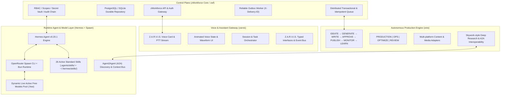
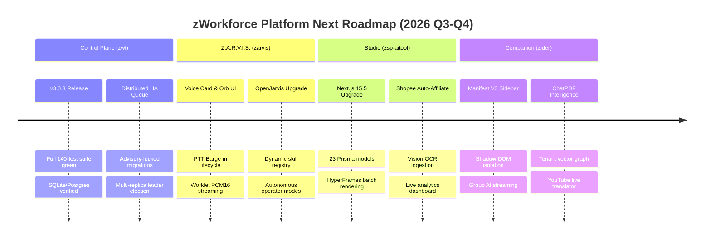

# zWorkforce Total Executive Master Planning (ZWT)

**Updated:** 2026-08-16  
**Status:** Unified Master Engineering & Operations Plan  
**Scope:** Full Project Execution, Control Plane (`zwf`), Content Engine (`zeto`), Voice/Assistant (`zarvis`), and Runtime Agent Platform (`hermes` + `spawn`).

---

## 1. Executive Master Architecture

`exec-planning.master.md` is the consolidated source of truth unifying the project lines with real-time agent execution capabilities:



---

## 2. Global Definition of Complete (DoD)

A capability or module is only marked complete when all criteria are satisfied:
1. **Zero Placeholders**: Production-grade implementation without mock stubs.
2. **Tenant Isolation**: All database queries, memory lookups, and vector joins enforce strict tenant boundaries.
3. **Secret Isolation**: Provider credentials remain server-side; browser/static code never receives upstream secrets.
4. **Durable State Transitions**: Mutations are transactional and state transitions persist in repository storage.
5. **Idempotency & Fencing**: At-least-once deliveries deduplicate using stable occurrence keys and delivery IDs.
6. **Audit & Provenance**: Cryptographic hash chains, tamper-evident logs, and artifact provenance.
7. **Comprehensive Test Suite**: Unit, integration, PostgreSQL recovery drills, provider fakes, and static lint checks pass.

---

## 3. Subsystem Breakdown & Execution Plans

### 3.1 Control Plane: `zWorkforce` (`zwf`)
- **Canonical Reference**: [`exec-planning-zwf.md`](exec-planning-zwf.md)
- **Status**: Production Release Candidate `v3.0.3`
- **Key Modules**:
  - `zworkforce/api.py`: Authenticated REST & WebSocket endpoints.
  - `zworkforce/database.py`: PostgreSQL 16+ / SQLite compatible durable storage.
  - `zworkforce/queue.py`: Transactional lease-expiry distributed task queue.
  - `zworkforce/outbox.py`: `X-ZWorkforce-Delivery-ID` reliable message dispatch.
  - `zworkforce/policy.py`: Denial-by-default mutating tool permissions.

### 3.2 Voice & Assistant Gateway: `Z.A.R.V.I.S.` (`zarvis`)
- **Canonical Reference**: [`exec-planning-zarvis.md`](exec-planning-zarvis.md)
- **Status**: Active Feature Delivery (`feat/zarvis-openjarvis-upgrade-plan`)
- **Key Modules**:
  - `packages/zarvis/apps/zvoice`: Low-latency WebRTC/WebSocket audio streaming.
  - `zworkforce/static/index.html` & `app.js`: Interactive dashboard voice card with animated audio orb.
  - Push-To-Talk (PTT) lifecycle: Pointer press/release and keyboard Space hold with interruption/barge-in support.
  - `packages/zarvis/docs/architecture/skills-agents.md`: Agent registry and execution mode contracts.

### 3.3 Production Content Engine: `Zeto` (`zeto`)
- **Canonical Reference**: [`exec-planning-zato.md`](exec-planning-zato.md)
- **Status**: Production Release Target
- **Key Modules**:
  - Full Content Lifecycle: `IDEATE → GENERATE → WRITE → APPROVE → SCHEDULE → PUBLISH → MONITOR → LEARN`.
  - Operating Model: `ROLE → INPUTS → MODES → CONSTRAINTS → OUTPUT → SELF-CHECK → EVIDENCE → OPTIMIZE`.
  - Multi-Platform Publisher: Safe adapter pipelines with rollback and audit trails.

### 3.4 AI Studio & Video Rendering: `zsp-aitool`
- **Canonical Reference**: [`exec-planning.zsp-aitool.md`](exec-planning.zsp-aitool.md)
- **Status**: Monorepo Integrated (`packages/zsp-aitool`, Port `:3005` / `studio.zeaz.dev`)
- **Key Modules**:
  - Presentation & Studio UI: Next.js 15.5 App Router + Tailwind CSS dashboard.
  - HyperFrames Video Studio: Multi-scene video generation, render queue, and background worker recovery.
  - Affiliate Intelligence & Vision OCR: Shopee OpenAPI product scraping and image text extraction.
  - Data & Storage: PostgreSQL 16 schema (23 models) with strict tenant isolation.

### 3.5 AI Browser Companion: `zider`
- **Canonical Reference**: [`exec-planning.zider.md`](exec-planning.zider.md)
- **Status**: Manifest V3 Production Target (`packages/zider`, Gateway Port `:8085`)
- **Key Modules**:
  - Extension Architecture: Shadow DOM isolated sidebar, service worker background orchestrator, and selection toolbar.
  - Multi-Model Router: SSE streaming, single chat, Group AI multi-model comparison, and OpenRouter Free fallback.
  - Document & Media Engines: ChatPDF tenant vector indexing, YouTube transcript extraction, and real-time translation.

### 3.6 Security & Vulnerability Remediation Loop: `zred-team`
- **Canonical Reference**: [`exec-zred-team.md`](exec-zred-team.md)
- **Status**: Active Continuous Security Hardening
- **Key Modules**:
  - Loop: `DISCOVER → TRIAGE → VALIDATE → ROOT-CAUSE → PATCH → TEST → REGRESSION TEST → SECURITY REVIEW → RE-SCAN`.
  - Boundaries: Zero raw secret leakage, SSRF IP filtering, PBKDF2 salted API tokens, bounded tool execution.

### 3.7 Runtime Agent Platform: `Hermes Agent` & `Spawn`
- **Status**: Fully Installed & Globally Linked (`~/.hermes/bin`, `~/.local/bin`)
- **Key Components**:
  - **Hermes Agent Core**: `~/.hermes/hermes-agent` (Python 3.11 + uv virtualenv).
  - **Spawn CLI**: `~/.local/bin/spawn` via Bun 1.3.14 runtime.
  - **Master Automation**: [`../scripts/install/install_hermes_full_stack_master.sh`](../scripts/install/install_hermes_full_stack_master.sh).
  - **Provider Credentials**: Loaded dynamically from `.env.ai`.

---

## 4. Feature Upgrade & Next Milestones Roadmap



---

## 4. Complete Skills Matrix (26 Active Integrated Skills)

All skills comply with the **`agentskills.io` standard** and are registered across the workforce and Hermes:

| Category | Skill Name | Specification & Primary Action |
| :--- | :--- | :--- |
| **Security & Governance** | `zworkforce-secure-editing` | Scoped code modifications preserving tenant boundaries and secret isolation. |
| | `zworkforce-policy-audit` | Audits RBAC, tokens, SSRF filters, MCP allowlists, and audit logs. |
| | `zworkforce-artifact-provenance` | Checksums, SBOMs, image digests, and release bundles. |
| **Architecture & Reliability** | `zworkforce-workflow-design` | Durable DAG workflows, occurrence keys, idempotency, and retries. |
| | `zworkforce-postgres-recovery` | Schema migrations, advisory locks, disaster recovery drills, and PITR verification. |
| | `zworkforce-incident-response` | Outage triage, containment, health probes, and diagnostic recovery. |
| | `zworkforce-repo-review` | Cross-package regression tests, API/doc drift checks, and production audits. |
| | `zworkforce-release-verification`| Release candidates, tag validation, changelogs, and deployment manifests. |
| **Voice & Orchestration** | `zworkforce-zarvis-contracts` | Contracts, session/task gateways, `zctl`, and Docker Compose configs. |
| | `zworkforce-zarvis-runtime-orchestration` | Multi-agent handoffs, continuous execution, capability policy, and supervision. |
| | `zworkforce-zarvis-voice-ui` | Realtime audio streaming, PTT, visual orb states, and voice BFF endpoints. |
| **Intelligence & Memory** | `zworkforce-rag-curation` | Tenant-scoped memory, local/Qdrant vector stores, and embeddings indexing. |
| | `zworkforce-finops-optimization` | AI token/credit spend, model tier rightsizing, and cost per outcome. |
| | `zworkforce-github-operations` | PR lifecycle, CodeQL security runs, and GHCR package automation. |
| **Diagnostic & Reasoning** | `debug-mantra` | 4-step debugging discipline (reproduce, trace fail path, falsify hypothesis, cross-reference). |
| | `scrutinize` | Adversarial code review verifying execution paths and intent. |
| | `qwen-agent` | Mechanical/scaffolding task delegation to lightweight workers. |
| | `qwenchance` | Context guard bounding loops and triggering clean task handoffs. |
| | `post-mortem` | Root-cause analysis (RCA) and post-incident documentation. |
| | `management-talk` | Translates engineering outputs to executive/stakeholder summaries. |
| | `supabase` / `supabase-server` | Database migrations, edge functions, and security rules. |
| | `supabase-postgres-best-practices` | Connection pooling, index tuning, and RLS policies. |
| | `agent-reach` | Cross-environment execution and tool distribution. |
| | `find-skills` | Meta-skill for dynamic discovery and loading of skills. |

---

## 5. Verification & Validation Protocol

```bash
# 1. Compile and Unit Tests
python -m compileall -q zworkforce tests
PYTHONPATH=. python -m unittest discover -s tests -v

# 2. System Doctor & Policy Audit
zworkforce doctor

# 3. PostgreSQL Regression & Recovery Drill
PYTHONPATH=. python -m unittest tests/test_v3_postgres.py -v

# 4. Master Hermes & Skills Dry Run
./install_hermes_full_stack_master.sh --dry-run
```
