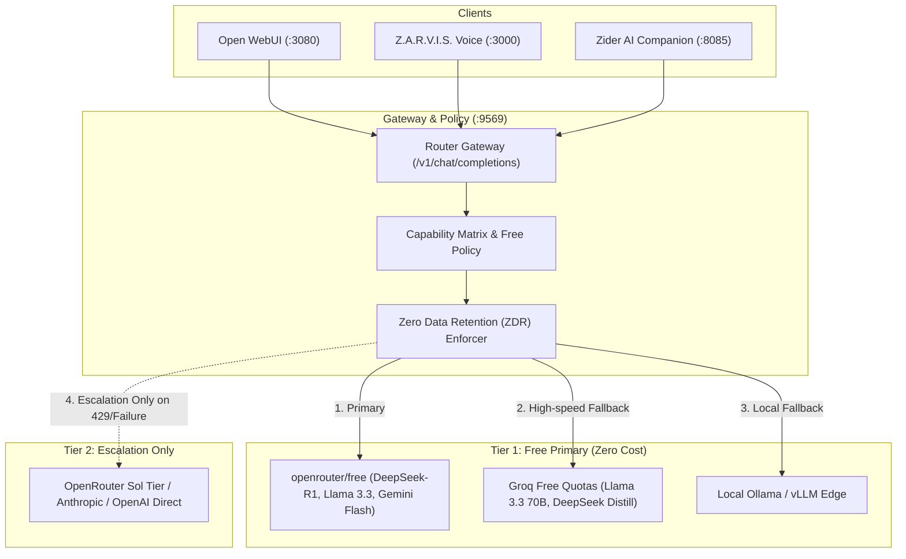

# Planning & Implementation: Multi-Model Router & Enterprise Gateway (`planning-implementation-router.md`)

**Updated:** 2026-08-17  
**Module:** Router Gateway, OpenRouter 600+ Model Catalog, Free-Model-First Dispatch, and Open WebUI  
**Parent Strategy:** [`exec-planning.master.md`](exec-planning.master.md) & [`exec-planning-router.md`](exec-planning-router.md)

---

## 1. Module Overview & Architecture

The Router Gateway manages intelligence dispatch with strict **Free Model First** routing:



---

## 2. Completed Implementation Milestones

- [x] **OpenRouter & Groq Free Tier Integration**: Unified routing to free tier models with zero-cost preference.
- [x] **Smart Variant Routing Slugs**: `:free` (zero cost), `:thinking` (reasoning), `:exacto` (tool calling), `:nitro` (latency tier).
- [x] **Zero Secret Containment**: Server-side vaulting via `.env.ai`; frontend clients never receive provider credentials.
- [x] **Universal Plugin Packaging**: Compatibility with `.codex-plugin/plugin.json` and `.agents/plugins/marketplace.json`.

---

## 3. Active & Upcoming Implementation Workstreams

### Phase 1: OpenRouter Broadcast Tracing & FinOps
- **Objective**: Programmatic trace export to OpenTelemetry, Langfuse, and Grafana Cloud with per-tenant token usage accounting.
- **Files**:
  - `zworkforce/telemetry.py`: OTLP / OpenRouter Broadcast trace processor.
  - `tests/test_telemetry.py`: Verification of metric histograms and token counters.

### Phase 2: Autonomous Agent Handoff & Guardrail Protocols
- **Objective**: Multi-agent routing with typed input/output validation, context compaction, and deterministic tool call evaluation on zero-cost free model tiers (`openai-agents-python` / `claude-agent-sdk` parity).
- **Files**:
  - `zworkforce/agent_handoff.py`: Typed handoff contracts and context window budgets.
  - `tests/test_agent_handoff.py`: Context isolation tests.

---

## 4. Verification & Validation Protocol

```bash
# 1. Compile & Unit Test
python3 -m compileall -q zworkforce tests
PYTHONPATH=. python3 -m unittest tests/test_api_v2.py -v

# 2. Open WebUI Health Check
curl -fsS http://localhost:3080/health || true
```
