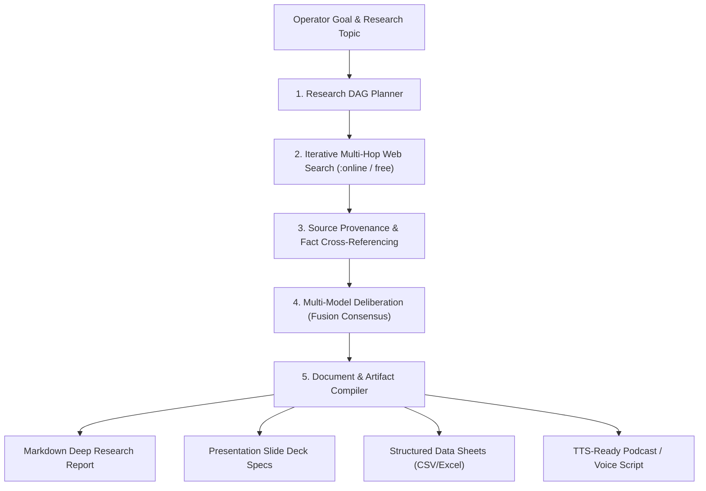

# Planning & Implementation: Skywork Deep Research Autonomous Super Agent (`planning-implementation-skywork.md`)

**Updated:** 2026-08-17T05:25Z (do-all-e2e + do-implementation-all-e2e cycle)  
**Module:** Skywork Autonomous Research Engine, Multi-Hop Web Grounding, A2A Context Bus, and Document Synthesis  
**Parent Strategy:** [`exec-planning.master.md`](exec-planning.master.md) & [`exec-planning-skywork.md`](exec-planning-skywork.md)

---

## 1. Module Overview & Architecture

The Skywork Super Agent executes autonomous multi-hop research, consensus deliberation, and multi-format document generation:



---

## 2. Completed Implementation Milestones

- [x] **Deep Research Architecture Specification**: Multi-hop search loops with iterative query refinement.
- [x] **Agent-to-Agent (A2A) Discovery & Context Protocol**: Standardized contracts for agent capability exchange.
- [x] **Provenance & Citation Tracking**: Enforces strict URL metadata and verified snippet linkage.
- [x] **Free Model First Deliberation**: Uses zero-cost reasoning models (`DeepSeek-R1:free`, `Llama-3.3-70B:free`) for multi-perspective synthesis.
- [x] **Structured Citation Schema Validation & Source Scoring (Phase 3)**:
  - Built `zworkforce/citation_validator.py` with strict URL, title, date, excerpt, and $\ge 0.65$ reliability scoring threshold.
  - Unit tests in `tests/test_v3_skywork_a2a.py`.
- [x] **Live A2A Agent Discovery & Capability Exchange (Phase 4)**:
  - Built `zworkforce/a2a_discovery.py` supporting `/.well-known/agent.json` discovery catalogs and tool capability matching.
  - Unit tests in `tests/test_v3_skywork_a2a.py`.

---

## 3. Active & Upcoming Implementation Workstreams

### Phase 1: Iterative Multi-Hop Search & Document Verifier
- **Objective**: Execute multi-turn web search using OpenRouter `:online` plugin and calculate document reliability scores.
- **Files**:
  - `zworkforce/deep_research.py`: Autonomous research pipeline and citation extractor.
  - `tests/test_deep_research.py`: Unit tests for citation graph creation.

### Phase 2: Multimodal Document Output Compilers
- **Objective**: Auto-compile research results into clean Marp slide decks, tabular CSVs, and SSML-tagged audio scripts.
- **Files**:
  - `zworkforce/document_compiler.py`: Multi-format artifact generators.

---

## 4. Verification & Validation Protocol

```bash
# 1. Bytecode Compilation & Unit Tests
python3 -m compileall -q zworkforce tests
PYTHONPATH=. python3 -m unittest discover -s tests -v
```
