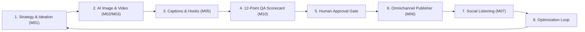

# Planning & Implementation: Zeto AI Content Factory (`planning-implementation-zato.md`)

**Updated:** 2026-08-17  
**Module:** `packages/zeto/` Content Lifecycle Engine (`IDEATE → GENERATE → WRITE → APPROVE → PUBLISH → MONITOR → LEARN`)  
**Parent Strategy:** [`exec-planning.master.md`](exec-planning.master.md) & [`exec-planning-zato.md`](exec-planning-zato.md)

---

## 1. Module Overview & Architecture

Zeto operates the enterprise content factory combining ProMeta prompt compilers, 12-point QA scorecards, and multi-channel publishing adapters:



---

## 2. Completed Implementation Milestones

- [x] **ProMeta Prompt Compiler Architecture**: Multi-mode execution (`PRODUCTION`, `OPS`, `OPTIMIZE`, `REVIEW`).
- [x] **Omnichannel Multi-Platform Publisher**:
  - Social adapters: Facebook Pages/Groups, Instagram Graph, TikTok Content, YouTube Data API, X (Twitter) v2, LinkedIn Marketing.
  - Shop adapters: Shopee Open Platform v2, TikTok Shop Seller API, Facebook Commerce Catalog.
- [x] **Cryptographic Verification**: HMAC-SHA256 partner key signing for Shopee OpenAPI v2 and TikTok Shop.
- [x] **Universal Plugin Packaging**: Packaged as `zworkforce-omnichannel-suite` with skills for content publishing, shop inventory sync, and order operations.

---

## 3. Active & Upcoming Implementation Workstreams

### Phase 1: Automated 12-Point QA Self-Correction Loop
- **Objective**: When a generated draft scores < 90, the agent autonomously executes targeted remediation before requesting human approval.
- **Files**:
  - `packages/zeto/src/qa_engine.ts`: Multi-criteria scoring engine (Brand palette, font policy, safe margins, claim substantiation).
  - `packages/zeto/tests/qa_engine.test.ts`: Automated remediation unit tests.

### Phase 2: Live Performance Feedback & Prompt Tuning
- **Objective**: Ingest social engagement metrics (views, shares, retention rate) and automatically recalibrate ProMeta prompt weights.
- **Files**:
  - `packages/zeto/src/feedback_optimizer.ts`: Retention curve analytics and prompt re-weighting.

---

## 4. Verification & Validation Protocol

```bash
# 1. Zeto Test Suite
pnpm --dir packages/zeto test

# 2. Control Plane Connectors Unit Test
PYTHONPATH=. python3 -m unittest tests/test_connectors.py -v
```
