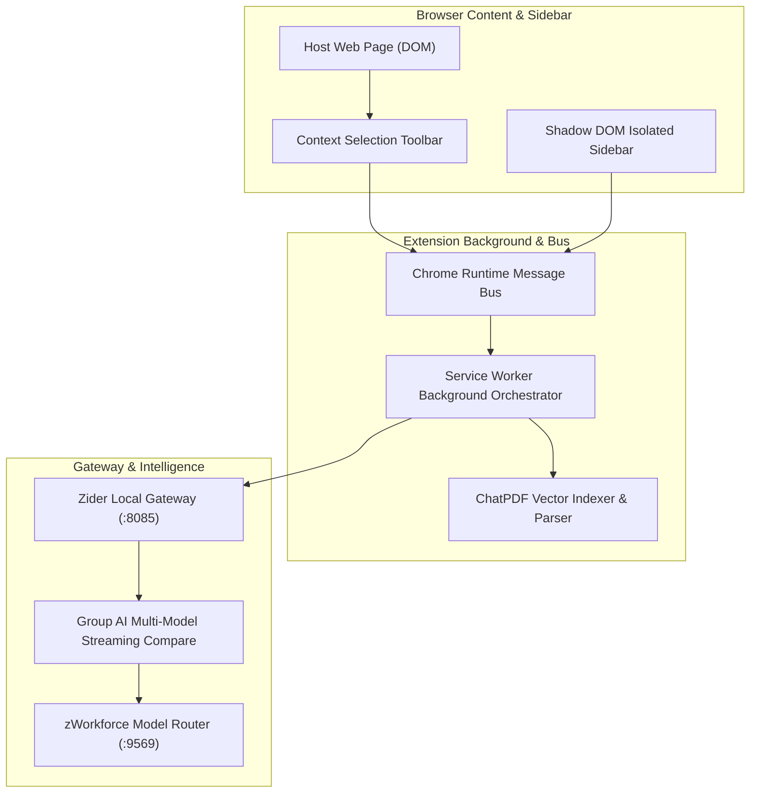

# Planning & Implementation: Zider AI Browser Companion (`planning-implementation-zider.md`)

**Updated:** 2026-08-17  
**Module:** `packages/zider/` Manifest V3 Browser Sidebar, Shadow DOM Isolation, ChatPDF, and YouTube Translator  
**Parent Strategy:** [`exec-planning.master.md`](exec-planning.master.md) & [`exec-planning.zider.md`](exec-planning.zider.md)

---

## 1. Module Overview & Architecture

Zider is an enterprise Manifest V3 browser extension operating on port `:8085`:



---

## 2. Completed Implementation Milestones

- [x] **Shadow DOM Isolation**: Prevents host page CSS and script collisions.
- [x] **Service Worker Message Bus**: Resilient Chrome extension background communication.
- [x] **Group AI Multi-Model Streaming**: Side-by-side comparison of free models (`Llama 3.3`, `DeepSeek-R1`, `Gemini Flash`).
- [x] **ChatPDF Vector Indexing**: Tenant-scoped vector storage and citation highlights.

---

## 3. Active & Upcoming Implementation Workstreams

### Phase 1: High-Precision Rerank & Web Grounding Pipeline
- **Objective**: Combine client vector search with OpenRouter `/rerank` API to filter top document chunks before summarization.
- **Files**:
  - `packages/zider/server/src/rerank_engine.ts`: Reranking pipeline.
  - `packages/zider/extension/src/content/pdf_highlighter.ts`: Citation visual overlay.

### Phase 2: Live YouTube Video & Audio Transcript Synchronizer
- **Objective**: Multi-language transcript extraction and real-time audio translation overlay.
- **Files**:
  - `packages/zider/extension/src/content/youtube_sync.ts`: Player timestamp synchronization.

---

## 4. Verification & Validation Protocol

```bash
# 1. Zider Build & Test
pnpm --dir packages/zider test
pnpm --dir packages/zider build
```
