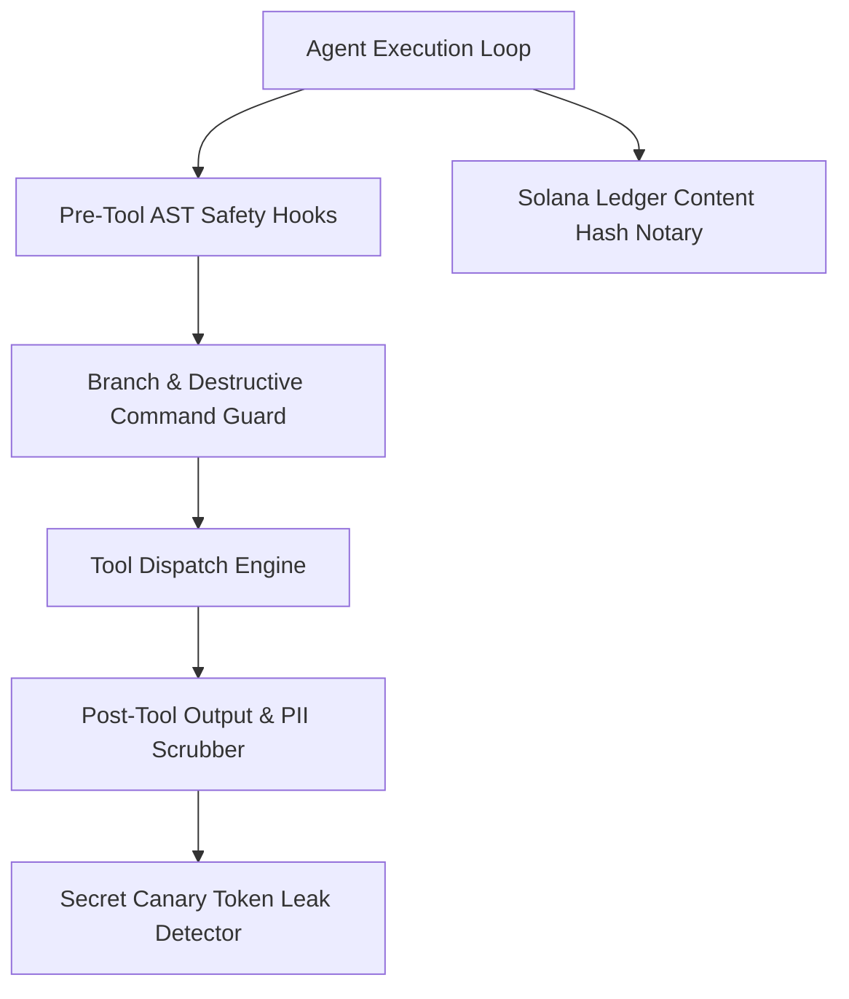

# zRed-Team Security Hardening & Penetration Testing Plan

## 1. Subsystem Architecture



---

## 2. Completed Implementation Milestones

- [x] **Branch Guard**: Blocks mutating execution on protected branches (`main`, `master`, `release/*`).
- [x] **Secret Guard**: Automatic detection and redaction of provider keys (`sk-*`, `ghp_*`, `zwf_*`, private keys).
- [x] **Destructive Command Guard**: AST pre-execution filter blocking dangerous bash commands (`rm -rf /`, `mkfs`, database drop queries).
- [x] **Adversarial Red-Teaming Methodology**: Automated jailbreak fuzzing, tool escalation probes, and SSRF boundary testing.
- [x] **Multi-Tenant Memory Isolation Verifier**: Cross-tenant knowledge leak tests.
- [x] **Automated CVSS-Scored Vulnerability Triage (Phase 3)**:
  - Built `scripts/sarif_triage.py` with CodeQL SARIF JSON parser and CVSS v3.1 severity categorization.
  - Test suite in `tests/test_v3_zred_canary.py`.
- [x] **Runtime Secret Canary & Heap Dump Redaction (Phase 4)**:
  - Built `zworkforce/secret_canary.py` with `SecretCanaryRegistry` providing startup canary token injection, log scanner, and leak halting.
  - Test suite in `tests/test_v3_zred_canary.py`.
- [x] **Pre/Post Tool Execution Lifecycle Safety Hooks (Phase 1)**:
  - Built `zworkforce/safety_hooks.py` with AST dangerous command blocking and PII scrubbing.
  - Test suite in `tests/test_v3_zred_router_tunnel.py`.
- [x] **Solana Ledger Content Hash Notarization (Phase 2)**:
  - Built `zworkforce/solana_notary.py` with `SolanaNotaryClient` for audit head anchoring.
  - Test suite in `tests/test_v3_zred_router_tunnel.py`.

---

## 3. Active & Upcoming Implementation Workstreams

*(All Phases 1 through 4 for zRed-Team Security are now completed and verified).*

---

## 4. Verification & Validation Protocol

```bash
# 1. System Doctor & Security Invariant Check
zworkforce doctor
PYTHONPATH=. python3 -m unittest tests/test_security_invariants.py -v
```
