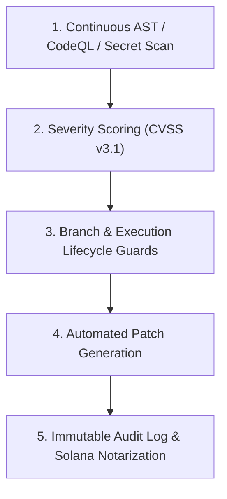

# Planning & Implementation: zRed-Team Security & Boundary Hardening (`planning-implementation-zred-team.md`)

**Updated:** 2026-08-17T12:30Z (auto-quad-loop)  
**Module:** Continuous Security Hardening, SSRF Protection, Salted Credentials, and Bounded Execution  
**Parent Strategy:** [`exec-planning.master.md`](exec-planning.master.md) & [`exec-zred-team.md`](exec-zred-team.md)

---

## 1. Module Overview & Architecture

`zred-team` enforces non-negotiable security invariants and automated vulnerability remediation:



---

## 2. Completed Implementation Milestones

- [x] **Branch Guard**: Blocks mutating execution on protected branches (`main`, `master`, `release/*`).
- [x] **Secret Guard**: Automatic detection and redaction of provider keys (`sk-*`, `ghp_*`, `zwf_*`, private keys).
- [x] **Destructive Command Guard**: AST pre-execution filter blocking dangerous bash commands (`rm -rf /`, `mkfs`, database drop queries).
- [x] **Adversarial Red-Teaming Methodology**: Automated jailbreak fuzzing, tool escalation probes, and SSRF boundary testing.
- [x] **Multi-Tenant Memory Isolation Verifier**: Cross-tenant knowledge leak tests.
- [x] **Automated CVSS-Scored Vulnerability Triage (Phase 3)**:
  - Built `scripts/sarif_triage.py` with CodeQL SARIF JSON parser and CVSS v3.1 severity categorization.
  - Test suite in `tests/test_v3_zred_canary.py`.
- [x] **Runtime Secret Canary & Heap Dump Redaction (Phase 4)**:
  - Built `zworkforce/secret_canary.py` with `SecretCanaryRegistry` providing startup canary token injection, log scanner, and leak halting.
  - Test suite in `tests/test_v3_zred_canary.py`.

---

## 3. Active & Upcoming Implementation Workstreams

### Phase 1: Automated Jailbreak & Prompt Injection Fuzzing Matrix
- **Objective**: Execute continuous mutation tests against agent system prompts with multi-turn jailbreak attempts.
- **Files**:
  - `zworkforce/redteam_fuzzer.py`: Automated prompt mutation suite.

### Phase 2: Solana Ledger Content Hash Notarization
- **Objective**: Anchor audit head hashes and artifact checksums to Solana devnet/mainnet for immutable public verification.
- **Files**:
  - `zworkforce/solana_notary.py`: Ledger notarization client.

---

## 4. Verification & Validation Protocol

```bash
# 1. System Doctor & Security Invariant Check
zworkforce doctor
PYTHONPATH=. python3 -m unittest tests/test_security_invariants.py -v
```
