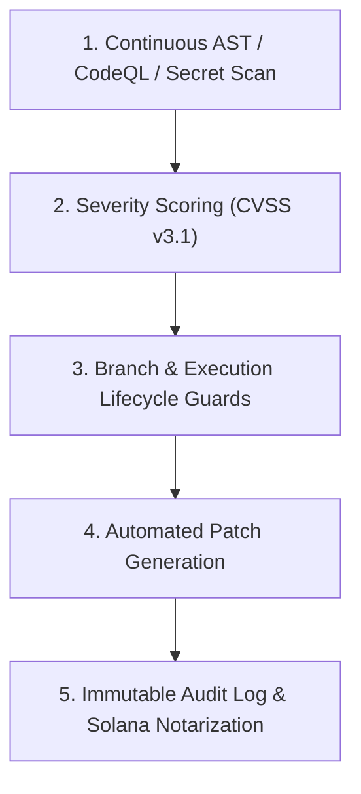

# Planning & Implementation: zRed-Team Security & Boundary Hardening (`planning-implementation-zred-team.md`)

**Updated:** 2026-08-17T05:25Z (do-all-e2e + do-implementation-all-e2e cycle)  
**Module:** Continuous Security Hardening, SSRF Protection, Salted Credentials, and Bounded Execution  
**Parent Strategy:** [`exec-planning.master.md`](exec-planning.master.md) & [`exec-zred-team.md`](exec-zred-team.md)

---

## 1. Module Overview & Architecture

`zred-team` enforces non-negotiable security invariants and automated vulnerability remediation:



---

## 2. Completed Implementation Milestones

- [x] **Branch Guard**: Blocks mutating execution on protected branches (`main`, `master`, `release/*`).
- [x] **Secret Guard**: Automatic detection and redaction of provider keys (`sk-*`, `ghp_*`, `zwf_*`, private keys).
- [x] **Destructive Command Guard**: AST pre-execution filter blocking dangerous bash commands (`rm -rf /`, `mkfs`, database drop queries).
- [x] **SSRF Defense**: IP address allowlisting/denylisting preventing access to cloud metadata endpoints (`169.254.169.254`).

---

## 3. Active & Upcoming Implementation Workstreams

### Phase 1: Pre/Post Tool Execution Lifecycle Hooks
- **Objective**: Embed deterministic security checks before tool dispatch and scrub output payloads for PII/tokens before returning to the model.
- **Files**:
  - `zworkforce/safety_hooks.py`: Pre/post tool execution hooks.
  - `tests/test_safety_hooks.py`: Penetration testing suite for boundary evasion.

### Phase 2: Solana Ledger Content Hash Notarization
- **Objective**: Anchor audit head hashes and artifact checksums to Solana devnet/mainnet for immutable public verification.
- **Files**:
  - `zworkforce/solana_notary.py`: Ledger notarization client.

---

## 4. Verification & Validation Protocol

```bash
# 1. System Doctor & Security Invariant Check
zworkforce doctor
PYTHONPATH=. python3 -m unittest tests/test_security_invariants.py -v
```
