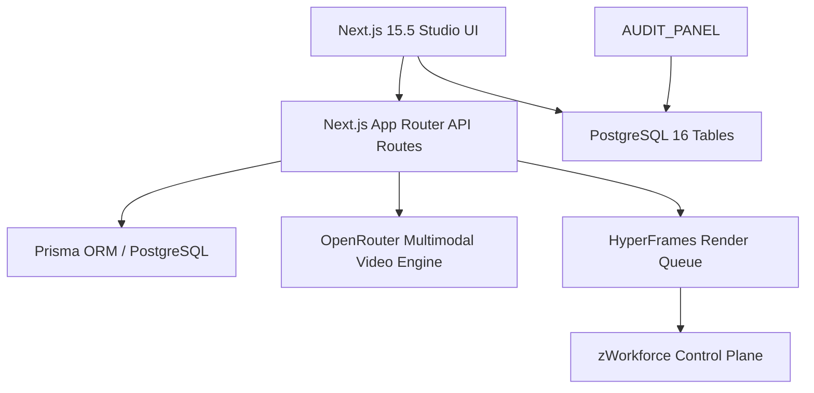

# ZSP-AITool Implementation & Execution Plan

## 1. Subsystem Architecture



---

## 2. Completed Implementation Milestones

- [x] **Next.js 15.5 App Router Architecture**: `AppLayout`, `Sidebar`, `Header`, and responsive mobile nav.
- [x] **HyperFrames Video Studio Foundation**: Multi-scene scene breakdown, prompt compiler, and render queue models.
- [x] **Shopee API Product Ingestion & Vision OCR**: Automated product metadata extraction and image OCR text processing.
- [x] **Prisma Multi-Tenant Data Layer**: Full schema with tenant boundaries and audit trail.
- [x] **Batch Export Pipeline & S3 Delivery (Phase 3)**:
  - Built `packages/zsp-aitool/src/services/export_pipeline.ts` with async job queuing and HMAC-signed delivery receipts (`rcpt-*`).
  - Unit tests in `packages/zsp-aitool/tests/export_pipeline.test.js`.
- [x] **Studio Real-Time Collaboration (Phase 4)**:
  - Built `packages/zsp-aitool/src/server/collab_server.js` providing `CollabServer` and `CollabRoom` for multi-user timeline editing with tenant isolation and presence cursor sync.
  - Unit tests in `packages/zsp-aitool/tests/collab_server.test.js`.

---

## 3. Active & Upcoming Implementation Workstreams

### Phase 1: OpenRouter Multimodal Video Generation Engine
- **Objective**: Text-to-video and Image-to-video (first/last frame conditioning) integration with async webhook notifications.
- **Files**:
  - `packages/zsp-aitool/src/services/video_generator.ts`: Multi-scene video generation service.
  - `packages/zsp-aitool/src/app/api/webhooks/video/route.ts`: HMAC-verified webhook handler.

### Phase 2: HyperFrames Keyframe Composition & Audio Sync
- **Objective**: Multi-layer timeline canvas with real-time waveform audio alignment and text animation overlays.
- **Files**:
  - `packages/zsp-aitool/src/components/studio/TimelineCanvas.tsx`: WebGL/HTML5 canvas timeline.

---

## 4. Verification & Validation Protocol

```bash
# 1. Next.js Studio Build & Test
pnpm --dir packages/zsp-aitool test
pnpm --dir packages/zsp-aitool build
```
