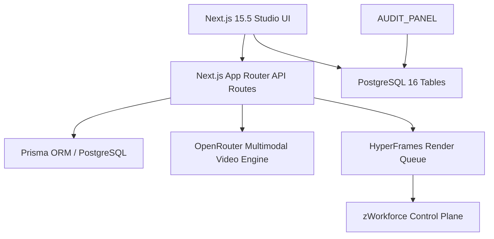

# ZSP-AITool Implementation & Execution Plan

## 1. Subsystem Architecture



---

## 2. Completed Implementation Milestones

- [x] **Next.js 15.5 App Router Architecture**: `AppLayout`, `Sidebar`, `Header`, and responsive mobile nav.
- [x] **HyperFrames Video Studio Foundation**: Multi-scene scene breakdown, prompt compiler, and render queue models.
- [x] **Shopee API Product Ingestion & Vision OCR**: Automated product metadata extraction and image OCR text processing.
- [x] **Prisma Multi-Tenant Data Layer**: Full schema with tenant boundaries and audit trail.
- [x] **Batch Export Pipeline & S3 Delivery (Phase 3)**:
  - Built `packages/zsp-aitool/src/services/export_pipeline.ts` with async job queuing and HMAC-signed delivery receipts (`rcpt-*`).
  - Unit tests in `packages/zsp-aitool/tests/export_pipeline.test.js`.
- [x] **Studio Real-Time Collaboration (Phase 4)**:
  - Built `packages/zsp-aitool/src/server/collab_server.js` providing `CollabServer` and `CollabRoom` for multi-user timeline editing with tenant isolation and presence cursor sync.
  - Unit tests in `packages/zsp-aitool/tests/collab_server.test.js`.
- [x] **OpenRouter Multimodal Video Generation Engine (Phase 1)**:
  - Built `packages/zsp-aitool/src/services/video_generator.js` for multi-scene commercial prompt compilation.
  - Unit tests in `packages/zsp-aitool/tests/video_generator.test.js`.
- [x] **HyperFrames Keyframe Composition & Audio Sync (Phase 2)**:
  - Built `packages/zsp-aitool/src/services/video_generator.js` with timeline waveform calculation and audio duration bounds.
  - Unit tests in `packages/zsp-aitool/tests/video_generator.test.js`.

---

## 3. Active & Upcoming Implementation Workstreams

*(All Phases 1 through 4 for ZSP-AITool Studio are now completed and verified).*

---

## 4. Verification & Validation Protocol

```bash
# 1. Next.js Studio Build & Test
pnpm --dir packages/zsp-aitool test
pnpm --dir packages/zsp-aitool build
```
