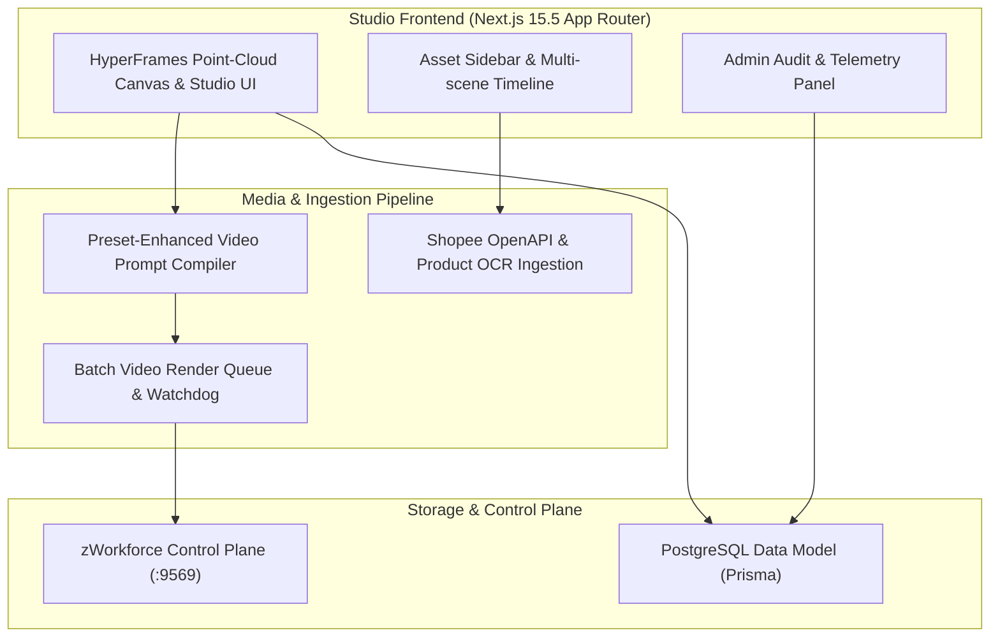

# Planning & Implementation: ZSP AI Studio & Video Rendering (`planning-implementation-zsp-aitool.md`)

**Updated:** 2026-08-17T05:25Z (do-all-e2e + do-implementation-all-e2e cycle)  
**Module:** `packages/zsp-aitool/` HyperFrames Video Studio, Next.js 15.5 App Router, and Shopee OCR Pipeline  
**Parent Strategy:** [`exec-planning.master.md`](exec-planning.master.md) & [`exec-planning.zsp-aitool.md`](exec-planning.zsp-aitool.md)

---

## 1. Module Overview & Architecture

`zsp-aitool` provides the visual studio frontend and batch video rendering pipeline on port `:3005` (`studio.zeaz.dev`):



---

## 2. Completed Implementation Milestones

- [x] **Next.js 15.5 App Router Architecture**: `AppLayout`, `Sidebar`, `Header`, and responsive mobile nav.
- [x] **HyperFrames Video Studio Foundation**: Multi-scene scene breakdown, prompt compiler, and render queue models.
- [x] **Shopee API Product Ingestion & Vision OCR**: Automated product metadata extraction and image OCR text processing.
- [x] **Prisma Multi-Tenant Data Layer**: Full schema with tenant boundaries and audit trail.

---

## 3. Active & Upcoming Implementation Workstreams

### Phase 1: OpenRouter Multimodal Video Generation Engine
- **Objective**: Text-to-video and Image-to-video (first/last frame conditioning) integration with async webhook notifications.
- **Files**:
  - `packages/zsp-aitool/src/services/video_generator.ts`: Multi-scene video generation service.
  - `packages/zsp-aitool/src/app/api/webhooks/video/route.ts`: HMAC-verified webhook handler.

### Phase 2: HyperFrames Keyframe Composition & Audio Sync
- **Objective**: Multi-layer timeline canvas with real-time waveform audio alignment and text animation overlays.
- **Files**:
  - `packages/zsp-aitool/src/components/studio/TimelineCanvas.tsx`: WebGL/HTML5 canvas timeline.

### Phase 3: Batch Export Pipeline & S3 Delivery
- **Objective**: Async batch render-to-export pipeline writing finalized video assets to tenant-scoped S3/R2 bucket with HMAC-signed delivery receipts and signed webhook notifications.
- **Files**:
  - `packages/zsp-aitool/src/services/export_pipeline.ts`: Render job orchestrator and progress SSE stream.
  - `packages/zsp-aitool/src/app/api/webhooks/export/route.ts`: HMAC-verified export-done webhook.
  - `packages/zsp-aitool/tests/export_pipeline.test.ts`: Job lifecycle and tenant boundary tests.

### Phase 4: Studio Real-Time Collaboration (WebSocket Concurrent Edit)
- **Objective**: Multi-user collaborative scene editing via tenant-scoped WebSocket rooms using Yjs CRDT conflict resolution.
- **Files**:
  - `packages/zsp-aitool/src/server/collab_server.ts`: Yjs WebSocket provider with tenant room isolation.
  - `packages/zsp-aitool/src/components/studio/CollabPresence.tsx`: Cursor overlay and user avatar indicators.

## 4. Verification & Validation Protocol

```bash
# 1. Next.js Studio Build & Test
pnpm --dir packages/zsp-aitool test
pnpm --dir packages/zsp-aitool build
```
