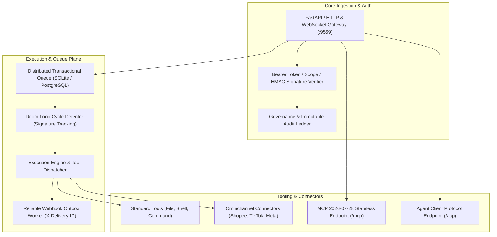

# Planning & Implementation: zWorkforce Core Control Plane (`planning-implementation-zwf.md`)

**Updated:** 2026-08-17  
**Module:** `zworkforce/` Python Control Plane, DB Repository, Distributed Task Queue, and Auth Gateway  
**Parent Strategy:** [`exec-planning.master.md`](exec-planning.master.md) & [`exec-planning-zwf.md`](exec-planning-zwf.md)

---

## 1. Module Overview & Architecture

`zworkforce` provides the production-grade control plane for multi-tenant AI workforce orchestration:



---

## 2. Completed Implementation Milestones

- [x] **Durable Multi-Tenant Database Repository**:
  - Schema evolution with PostgreSQL session advisory locks and SQLite fallback (`zworkforce/db.py`, `zworkforce/db_migrations.py`).
  - Immutable cryptographic hash chain for audit events (`zworkforce/db_governance.py`).
- [x] **Automatic Doom-Loop Detection Engine (R8.2)**:
  - Tracks sorted tool call signatures and consecutive failure counters in `zworkforce/engine.py`.
  - Configurable thresholds (`doom_loop_max_identical_calls`, `doom_loop_max_consecutive_failures`) in `zworkforce/config.py`.
- [x] **Omnichannel Social & Shop Connectors**:
  - Built `zworkforce/connectors.py` supporting Shopee Open Platform v2, TikTok Shop Seller API, and Facebook Commerce.
  - Implemented HMAC-SHA256 signature verification and fail-closed approval governance.
- [x] **Slash Command Interactive Navigation (SW2/SW11)**:
  - Interactive popup autocomplete menu and contextual documentation hints in web static frontend (`index.html`, `app.js`, `styles.css`).

---

## 3. Active & Upcoming Implementation Workstreams

### Phase 1: Secure MCP Reverse Tunnel Client Gateway
- **Objective**: Allow localhost / private edge MCP servers to securely connect to cloud workforce without inbound ports.
- **Files to Implement/Touch**:
  - `zworkforce/tunnel.py`: Reverse-tunnel client using encrypted WebSockets and ephemeral ticket auth.
  - `zworkforce/api.py`: Endpoint `POST /api/v1/mcp/tunnel/connect`.
  - `tests/test_tunnel.py`: Unit test suite verifying tunnel handshake, heartbeat, and tool forwarding.

### Phase 2: Agent Client Protocol (ACP) Multi-IDE Integration
- **Objective**: Expose full ACP JSON-RPC standard for Cursor, VS Code, and Zed editor companion integration.
- **Files to Implement/Touch**:
  - `zworkforce/acp.py`: Bidirectional ACP server with standard operations (`initialize`, `newSession`, `prompt`, `cancel`, `requestPermission`).
  - `tests/test_acp.py`: ACP compliance test suite.

---

## 4. Quality & Verification Gates

```bash
# 1. Bytecode Compilation & Unit Tests
python3 -m compileall -q zworkforce tests
PYTHONPATH=. python3 -m unittest discover -s tests -v

# 2. System Health Doctor
zworkforce doctor

# 3. PostgreSQL Concurrency & Regression
PYTHONPATH=. python3 -m unittest tests/test_v3_postgres.py -v
```
